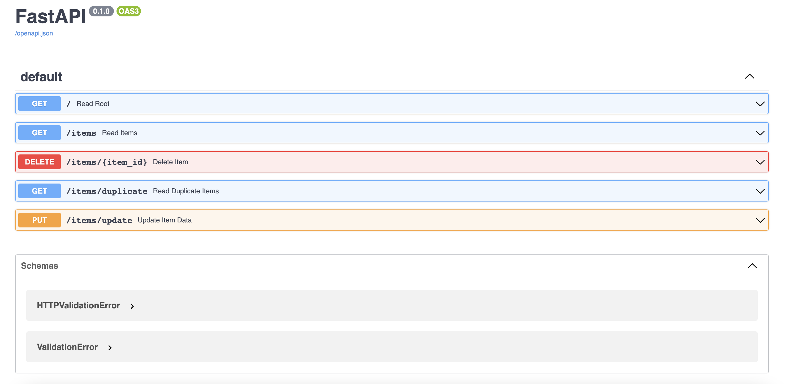
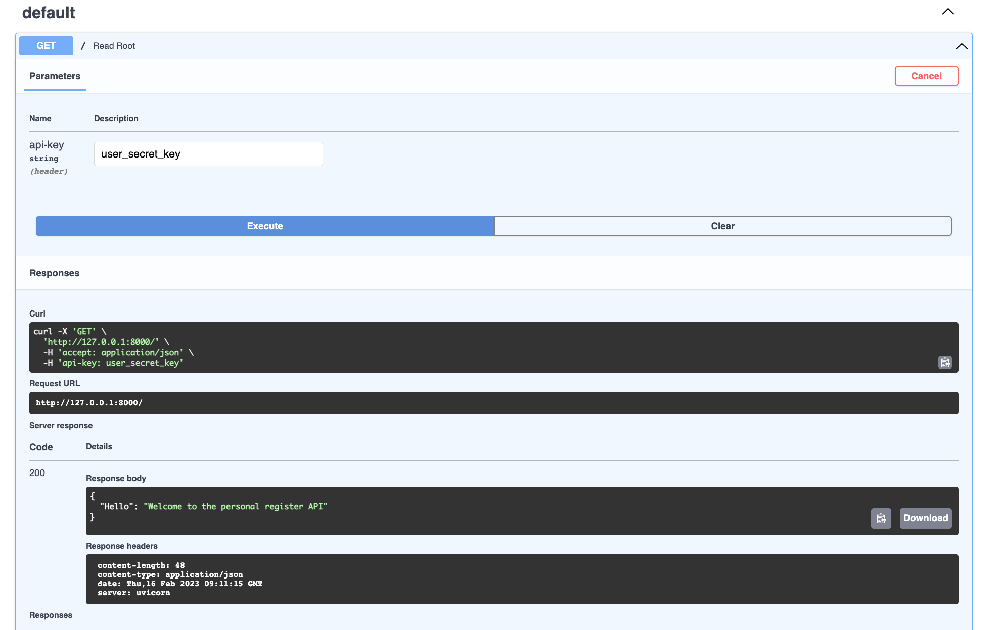
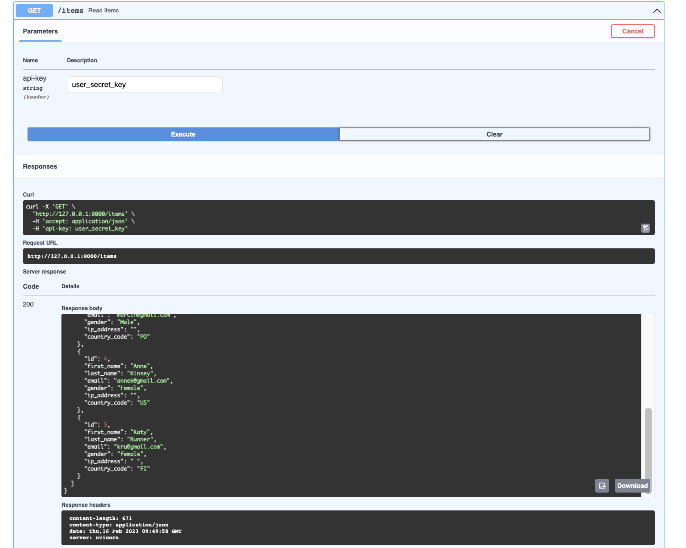
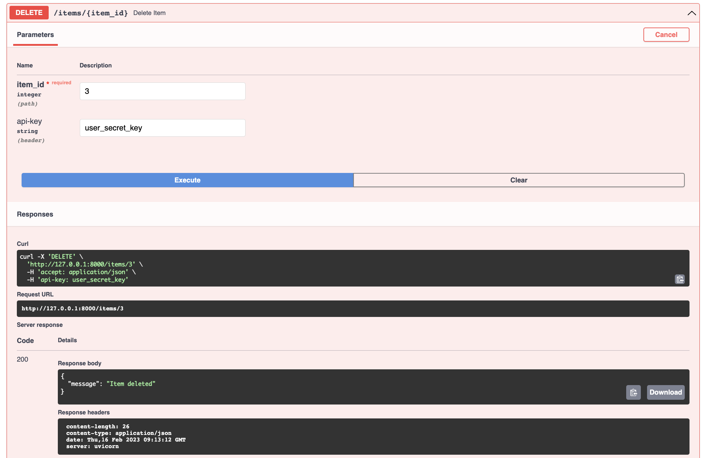
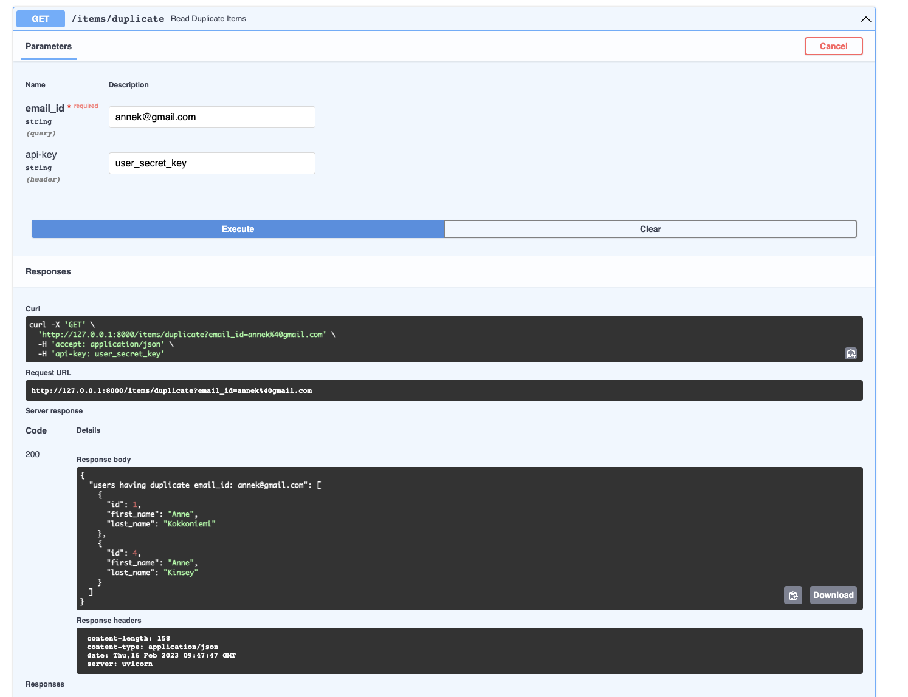
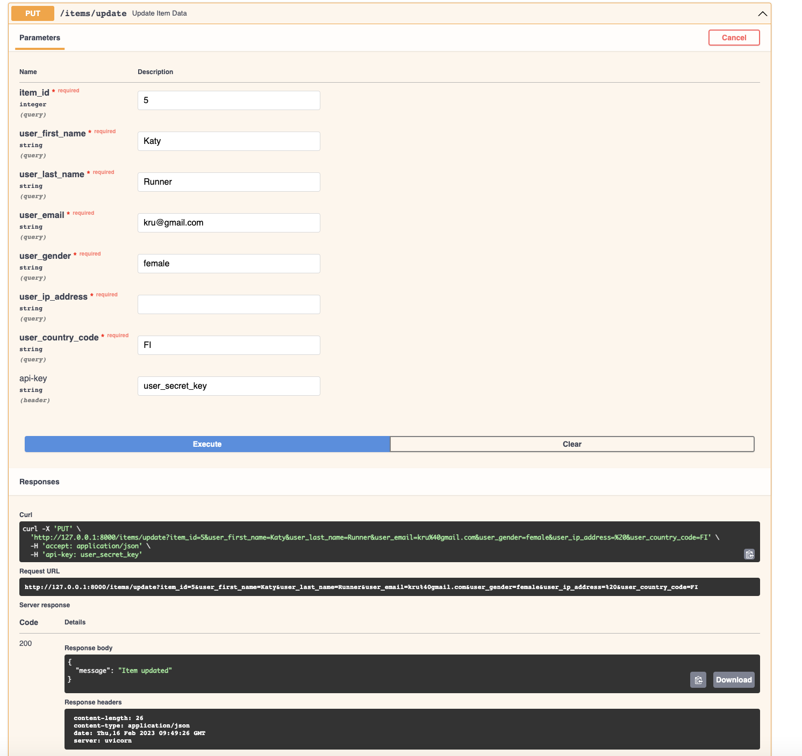
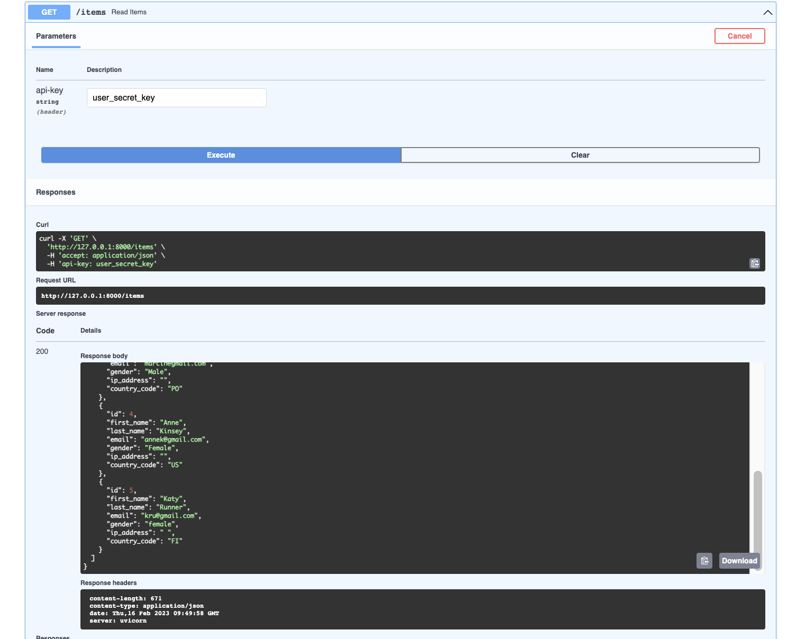

# personal-information-register-fast-api

## 1. Quickstart

### 1.1. Using Docker

To start the API using Docker, follow the following 4 steps:

1. git clone the repo:

```
git clone https://github.com/KrittikaSaha/personal-information-register-fast-api.git
```
2. Run the docker daemon. Depending on the OS, for Windows, one may use Docker Desktop, for LInux and Mac one may use Rancher Desktop. For linux, example step to start running docker daemon manually:
```
sudo systemctl start docker
```
3. Once docker daemon is running, build the image using the dockerfile provided in the repo:

```
docker build -t fastapi_app .
```
4. Now run the Docker image:
```
docker run -p 8000:8000 fastapi_app
```
The API should be running at http://0.0.0.0:8000/docs


### 1.2. Running from local

Pre-requisites: Python3
1. Activate virtualenv

```
virtualenv venv
# For Linux/Mac:
source venv/bin/activate
# For Windows:
. venv/Scripts/activate
```
2. Pip install requirements
```
pip install -r requirements.txt
```
3. cd into /app directory
```
cd app
```
4. Generate data and create database

```
python3 data_generator.py
python3 db.py
```

5. Run the app:
```
uvicorn main:app --reload
```

The API should be running at http://127.0.0.1:8000/docs


## 2. Exploring the functionality of the app

The API has 4 functionalites and looks like:

To test the functionalities, there are 2 ways of doing it:
### Using Swagger UI

FastAPI provides automatically generated documentation interfaces for our APIs, which we can interact with through a web interface. We can see that when we navigate to /docs .

Lets start with going to the root of the url. Since the api contains sensitive information, in order to explore the functionalities each api-call requires an api-key which needs to match the value stored in [credentials.py](app/credentials.py)

Go to the /docs link of the url and click on each tab to see the functionalioties:
1. The GET/Read Root shows a welcome message

2. The GET/items Root shows all the items in the database

3. The DELETE/items/{item_id} shows how to delete a record

4. The GET/items/duplicate shows users with duplicate email_id

5. The PUT/items/update shows how to update or add a new record:

Changes visible in GET/items



## 3. Explanation of the code 
The repo contains the Dockefile with all instructions to run teh application in a container. The app folder contains the code to create the app.

3.1 data_generator.py
This file contains code to generate a json document with some records

3.2. db.py
This file creates a sqlite database using the data generated in previous step.

3.3. models.py
This file connects to the database created in previous step, and contains functions to carry out ACID transactions using sslite queries. It has the following functions:
- get_data: This shows all the records in the database
- delete_data: This deletes data from database
- get_duplicate_data: This lists users that have duplicate email_id
- update_data: This updates or adds new records input by the user on API

3.4. main.py
This file connects the FASTAPI with the functions created in models.py to allow users to interact with the database. 

3.5. credentials.py
This file contains the secret api_key value that user needs to put in the header to authenticate before getting or putting any data in the database.

